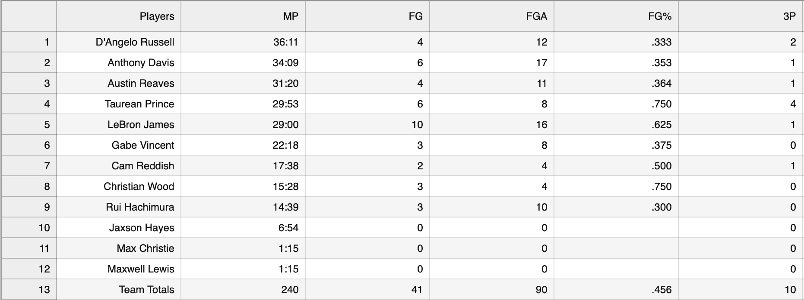
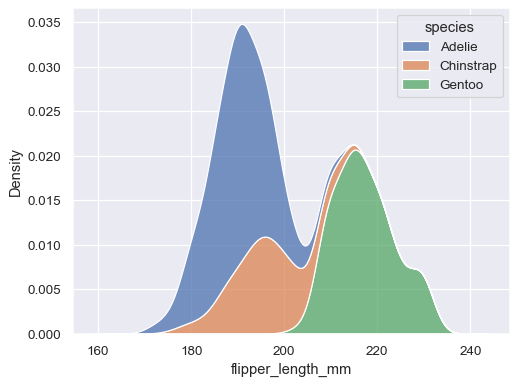
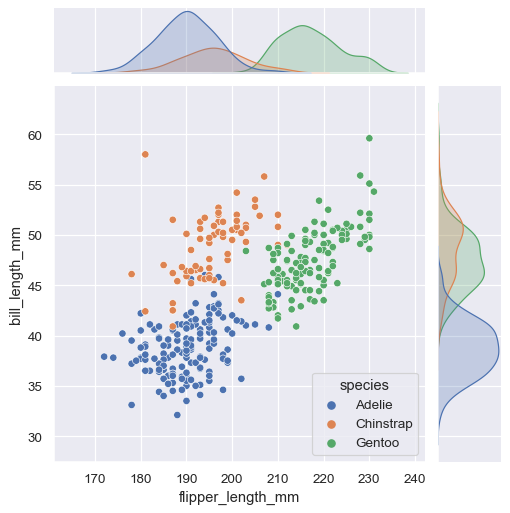
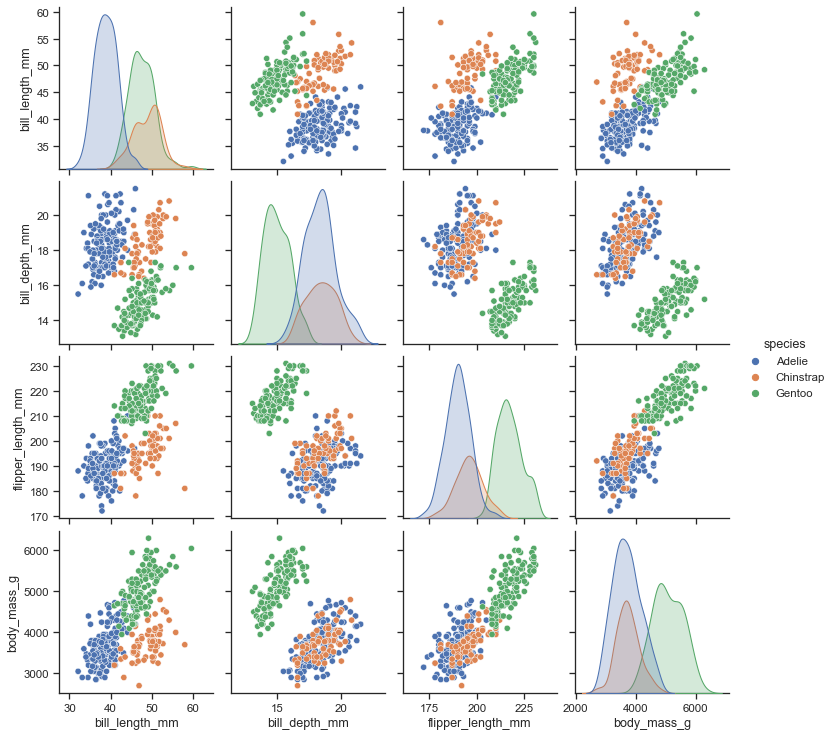

# Welcome to the Swish Insights team project website

### By: Brandon Smeltz, Michael Parker, & Elvin Lee

This is a website to showcase our final project for FIN 377, Advanced Investment: Data Science for Finance, course at Lehigh University.

To see the complete analysis files click [here](https://github.com/Brandon4106/Fin_377_Swish_Insights/tree/main/notebooks).

## Table of contents
1. [Introduction](#intro)
2. [Methodology](#meth)
3. [Analysis](#anal)
    1. [Preprocessing](#prep)
    2. [Custom Scoring](#cscore)
    3. [CV Fold](#fold)
    4. [Machine Learning](#ML)
    5. [Outputting Model Prediction](#output)
4. [Takeaways & Next Steps](#takeaways)
5. [About the Team](#about)
6. [For more info](#more)

## Introduction  <a name="intro"></a>

The main goal of this project is to train a model that can aid sports bettors with bets for the NBA season. In particular, the model will do an in depth analysis of one team and try to make a profit on the spread for the games in March, the holdout set. The model will accomplish by using the statistics it's learned throughout the season, in the training set. This analysis requires a significant amount of scraping for the one team we have selected the Celtics as well as additional scraping to build predictions for the Celtics opponents.

## Methodology <a name="meth"></a>

Here is some code that we used to develop our analysis:

#### Scraping stats from box scores
 

```python
def save_box_scores(formatted_date_list, simple_games_df, url_base):
    # Create a main directory to hold all data before zipping
    main_folder = 'NBA_Box_Scores'
    os.makedirs(main_folder, exist_ok=True)
    
    for date in formatted_date_list:
        games_df = simple_games_df[simple_games_df['Date'] == date]
        for index, row in games_df.iterrows():
            home_abbr = row['Home']
            away_abbr = row['Away']
            game_folder = f"{date}/{away_abbr}@{home_abbr}"  # Folder name format: YYYYMMDD/Away@Home
            full_folder_path = os.path.join(main_folder, game_folder)
            os.makedirs(full_folder_path, exist_ok=True)

            # Format the URL
            formatted_url = f"{url_base}{date}0{home_abbr}.html"
            # Fetch and save box scores
            try: 
                response = fetch_with_retry_after(formatted_url)
                
            # Save each team's box score in the specific game folder
                away_df,home_df = get_boxscore(response.text)
                away_df.to_csv(f"{full_folder_path}/away_team.csv", index=False)
                home_df.to_csv(f"{full_folder_path}/home_team.csv", index=False)
            except Exception as e:
                print(f"Error fetching data for URL {formatted_url}: {str(e)}")
            
    # Zip the entire directory
    with ZipFile(f"{main_folder}.zip", 'w') as zipf:
        for root, dirs, files in os.walk(main_folder):
            for file in files:
                zipf.write(os.path.join(root, file), os.path.relpath(os.path.join(root, file), os.path.join(main_folder, '..')))

# Example usage
url_base = "https://www.basketball-reference.com/boxscores/"

save_box_scores(formatted_date_list, simple_games_df, url_base)
```

Here is a sample output of part of the box score data received for one of the Lakers games this season:


<br><br>
    
**Note: The full script to obtain these box scores is in runboxscores.ipynb which can be found** [here](https://github.com/Brandon4106/Fin_377_Swish_Insights/tree/main/notebooks)

    
## Analysis <a name="anal"></a>

#### After obtaining the box scores we began to analyze the data by breaking it down into the following pieces:
1. Preprocessing
2. Custom Scoring
3. CV Fold
4. Machine Learning
5. Outputting Model Prediction

### Preprocessing <a name="prep"></a>
This is a subsection, formatted in heading 3 style

### Custom Scoring <a name="cscore"></a>
This is a subsection, formatted in heading 3 style

### CV Fold <a name="fold"></a>
This is a subsection, formatted in heading 3 style

### Machine Learning <a name="ML"></a>
This is a subsection, formatted in heading 3 style

### Outputting Model Prediction <a name="output"></a>
This is a subsection, formatted in heading 3 style

 

GRAPH INPUT CODE:

Here are some graphs that we created in our analysis. We saved them to the `pics/` subfolder and include them via the usual markdown syntax for pictures.


<br><br>
Some analysis here
<br><br>

<br><br>
More analysis here.
<br><br>

<br><br>
More analysis.


## Takeaways & Next Steps <a name="takeaways"></a>

1. We were able to learn a lot during the completion of this project...

2. Our models yield profitable results over the 16 game span that the we used in the holdout set for the Celtics this season. When the model was told to predict the spread of these 16 games and bet $100 on the predicted winning line for each game, it correctly predicted 11/16 of the games for a profit of $500. This is a 69% win       rate and correlates to an ROI of 31.25% which is very high.
    
3. From this analysis, we are curious to expand this project to look at the other 29 teams as well to identify more potentially profitable spreads as well as to collect more data and further verify the validity of our model.

4. Another interesting avenue would be to also look at the total score prop and use a similar process to identify whether or not the over/ under should be selected for a particular game.


## About the team <a name="about"></a>


<br>
Brandon is a junior at Lehigh University in the IBE Honors Program as well as the MFE Program. Brandon is currently studying mechanical engineering and finance with an interest in pursuing a masters in financial engineering. Brandon will be working as a financial analyst at Air Products this summer and is excited to apply his knowledge learned at Lehigh into the real world. In his free time, Brandon likes to watch/ play sports with friends, relax at the pool, and cook.
<br><br><br>


<br>
Elvin is a junior at Lehigh University pursuing a degree in Finance. Elvin is from Los Angeles and enjoys playing poker in his free time.
<br><br><br>


<br>
Michael is a junior at Lehigh University in the IBE Honors Program pursuing degrees in Finance and Mechanical Engineering, with plans to complete a masters in financial engineering. This summer, Michael will be completing Financial Engineering research. In his spare time, Michael likes to play piano and guitar, watch soccer, play tennis, and spend time with friends.

## More <a name="more"></a>

To view the GitHub repo for this website, click [here](https://github.com/Brandon4106/Fin_377_Swish_Insights).
